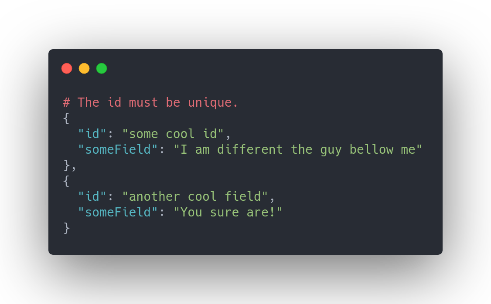

# react-window-dynamic-list

> Made with the awesome [create-react-library](https://github.com/transitive-bullshit/create-react-library)

[](https://www.npmjs.com/package/react-window-dynamic-list) [](https://standardjs.com)

## How is this different from `react-window`?
This library comes to partly solve the case of rendering dynamically sized items with [react-window](https://github.com/bvaughn/react-window).
For more information about the issue please read [this thread](https://github.com/bvaughn/react-window/issues/6).  
Before you overjoy please read the [limitations](#warning-requirements-and-limitations-warning) of this approach down bellow :sleepy:

## Demo
👉 [check out dynamic list in action](https://gnir-work.github.io/react-window-dynamic-list/)

## Install

```bash
npm install --save react-window-dynamic-list
```

## Usage


Yep. its that simple :satisfied:  
The api is the same as [VariableSizeList](https://react-window.now.sh/#/api/VariableSizeList) with small changes and additions.
#### Changes
1. Instead of `itemCount` you must pass `data` ([read more](#data-prop)
2. We handle `itemSize` and `estimatedItemSize` for you :sunglasses:

#### Additions
| Property          | Type               | Required? | Description                                                                                                                                                                                                                                                                                               |
| :---------------- | :----------------- | :-------: | :-------------------------------------------------------------------------------------------------------------------------------------------------------------------------------------------------------------------------------------------------------------------------------------------------------- |
| onRefSet        | Function            |           | This callback will be called when the virtualized list is rendered and the ref to the list is set.  For example if you want to scroll to an item on mount use `onRefSet` instead of `useEffect` because the virtualized list is rendered only after measurement.                                                                                                                              |

## Implementations details
This solution is a really naive one, basically we do the following actions:
1. Render the whole list, without windowing!
2. measure all of the cells and cache the size.
3. Remove the list.
4. Render the virtualized list using the cached sizes.

## :warning: Requirements and Limitations :warning:
1. It is feasible and possible (you have all of the data at hand) to load the data at the beginning for a brief time.
2. Your data doesn't change its size
3. You don't add new items to the list (filtering works :smirk:)
4. Currently this only supports vertical layout. (didn't have time to implement support for horizontal)
 
## Data prop
The data props is expected to be an array of objects where each object contains an `id` field.


## License

MIT © [gnir-work](https://github.com/gnir-work)
